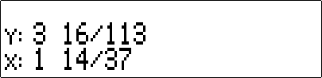

# EXACT

`EXACT` simulates a stack (`x`, `y`, `z`, `t` and `last x`) whose values are integers or fractions:

Calculations performed in this new stack are always “exact” since it only manipulates whole numbers internally.

Only a limited set of functions are accessible in this mode:

* `[÷]`, `[×]`, `[-]`, `[+]`
* `[←]`
* `[+/-]`
* `[1/x]`
* `[Enter]`
* `[Last x]`
* `[x<>y]`
* `[R↓]`

The dot key `[.]` is used to quickly enter fractions. Eg. press `[5][1][.][3][7]` for `51/37`:

When the program is started, `EXACT` tries to convert existing values in the stack to fractions. Inaccuracies may occur in the conversion (for eg. irrational numbers are always approximated).

## How to exit “exact” mode

To close the program cleanly, press `[shift] + [Modes]`.

On closing, stack values (`x`, `y`, `z` and `t`) are converted to floating point numbers.

## Customizing the display

Press `[shift] + [Disp]` to swich between “improper” and “proper/mixed” fraction display:

Improper fractions:

Mixed/proper fractions:

## Note on speed

Although the program can run on a real HP-42S, it’s rather slow. `EXACT` is intended to run on emulators/simulators.

## Requirements

The program `→Q` in needed (included in `exact.raw`).
