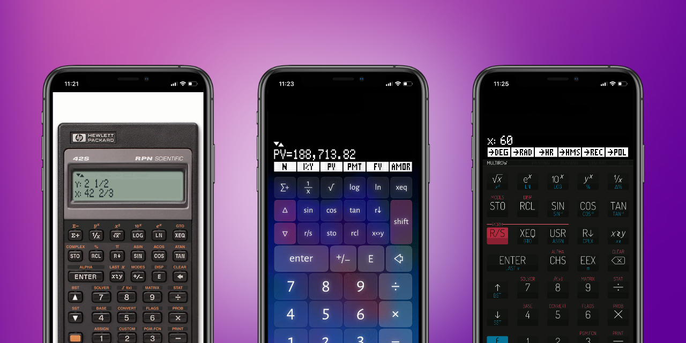

# Skins for Free42

Collection of skins for the HP-42S simulator [Free42](https://thomasokken.com/free42/)
 by [Thomas Okken](https://github.com/thomasokken).

The skins are designed for iPhone-X, but may also be used on other mobile phones.

From left to right:

* `HP-42S-X`: realistic HP-42S skin (with the colors of the HP-32SII).
* `42s-X`: rearranged key layout with large numbers for easier entry.
* `ClassicRPN`: skin redesign of the eponymous application by AmeloConsulting (`ClassicRPN` was a great emulator for HP Voyager series but now no longer available on the App Store).
